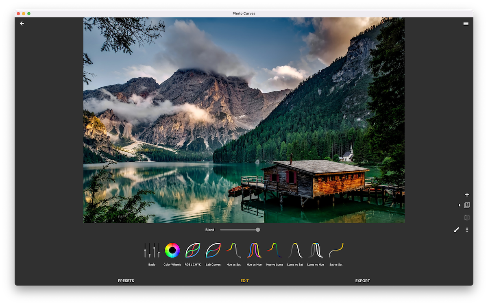

# Photo Curves - Color Grading App

## Overview

Photo Curves is a color grading app for photos with basic video support. Available for Android, iOS and macOS.

You can use it online: [Photo Curves for Web](https://photocurves.curvednebula.com)

Or as a standalone app:

  

Create custom filters instead of searching through hundreds of predefined LUTs. Photo Curves comes with example LUTs too, which are fully editable using RGB, CMYK, LAB, HSL curves, color wheels, and other tools. Correct, enhance or replace colors, shift HUE, fix white balance or create cinematic orange and teal look, create 3D LUTs or presets library, resize images, and more.

## LUTs & Preset Library

- Create new presets or edit existing
- Export presets as 3DLUT (.cube files)
- Export or import entire preset library (.pcurv file)

## Color Grading Tools

- **Basic controls** - brightness, contrast, shadows, highlights, saturation.

- **Color wheels** - mix color tones into shadows, midtones, or highlights.

- **Layer Masks** - create adjustment layers and draw masks to apply color grading effects to a selected area of an image.

- **RGB curves** - adjust red/green/blue channels of RGB color space.

- **CMYK curves** - adjust cyan/magenta/yellow/key channels of CMYK color space.

- **LAB curves** - LAB color space gives yet another level of creative freedom.

- **Hue vs Saturation curve** - select HUE range and change saturation: i.e., turn the entire image black and white while preserving one color only.

- **Hue vs Hue curve** - select HUE range and change colors: i.e., change the blue sky into purple or green grass into orange to dramatically change the mood of your photos.

- **Hue vs Luma curve** - select HUE range and change brightness.

- **Luma vs Saturation curve** - adjust saturation of shades, midtones, and highlights.

- **Luma vs Hue curve** - shift HUE of shades, midtones, or highlights.

- **Saturation vs Saturation curve** - boost unsaturated and decrease oversaturated colors to create evenly saturated HDR-like images.
