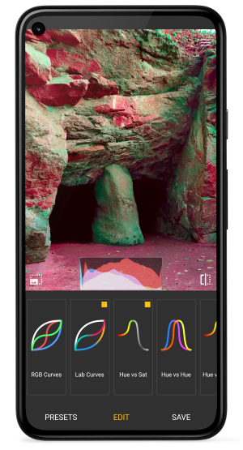

# Photo Curves - Color Grading

Photo Curves is a photo editing app with focus on color grading. Experiment with your photos using flexible color grading tools. Create your own filters/LUTs instead of searching through hundreds of apps with predefined presets, which you can't adjust. Each preset in Photo Curves is fully adjustable. You can easily create your custom presets too. With this app you can also correct, enhance or replace colors, fix white balance, create LUTs, resize images and more.

*Currently the app is only available for Android. iOS is coming.*

[Photo Curves for Android](https://play.google.com/store/apps/details?id=com.foreachi.photocurves)

## Presets Library

- Create your own presets or edit existing
- Export presets to .pcurv file to share or import presets created by others
- Export current editing to LUT (3DLUT .cube files)

## Color Grading Tools

- **Basic controls** - brightness, contrast, shadows, highlights, saturation.

- **Color wheels** - add color to shadows, midtones, or highlights.

- **RGB curves** - control red, green, and blue channels independently.

- **LAB curves** - unlike RGB, LAB color space allows you to manipulate color channels separately from brightness component. This gives you much more creative freedom to play with colors.

- **Hue vs Saturation curve** - make one color more vibrant than others, or leave one or two colors only, making the rest of the picture black and white.

- **Hue vs Hue curve** - replace colors or color ranges with another color(s) by shifting their hue. I.e. you can change the color of the blue sky or green grass, which can completely change the mood of your photo.

- **Hue vs Luma curve** - adjust brightness of selected colors or color ranges. This allows you to brighten or dim parts of your image creating interesting creative effects.

- **Luma vs Saturation curve** - adjust saturation of shades, midtones, or highlights.

- **Luma vs Hue curve** - shift hue of shades, midtones, or highlights.

- **Saturation vs Saturation curve** - boost saturation of unsaturated parts of your picture and decrease over-saturated areas to create evenly saturated HDR like pictures.
