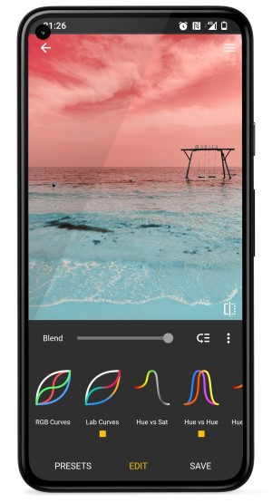
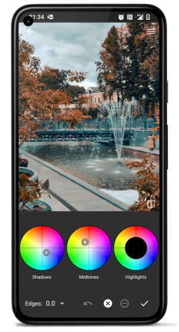
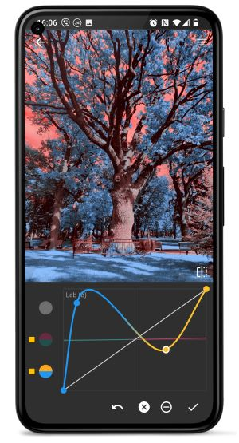
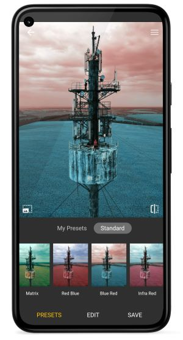

# Photo Curves - Color Grading App

Photo Curves is a photo editing app with focus on color grading. Experiment with your photos using flexible color grading tools. Create your own filters/3DLUTs instead of searching through hundreds of apps with predefined presets. Each preset in Photo Curves is fully adjustable. You can easily create your custom presets too. With this app you can also correct, enhance or replace colors, fix white balance, create LUTs, resize images and more.

 

More downloads:

- **[Photo Curves for macOS (Beta)](/downloads/PhotoCurves-1.2.17-beta.dmg)**

## Presets Library

- Create your own presets or edit existing
- Export presets to .pcurv file to share or import presets created by others
- Export current editing as 3DLUT (.cube) files

## Color Grading Tools

- **Basic controls** - brightness, contrast, shadows, highlights, saturation.

- **Color wheels** - add color to shadows, midtones, or highlights.

- **Layer Masks** - adjustment layers with masks.

- **RGB curves** - control red, green, and blue channels independently.

- **CMYK curves** - control cyan, magenta, yellow, and key channels of CMYK color space.

- **LAB curves** - unlike RGB, LAB color space allows you to manipulate color channels separately from brightness component.

- **Hue vs Saturation curve** - enhance specified colors or leave one color only, making the rest of the picture black and white.

- **Hue vs Hue curve** - replace color or color ranges with another color(s) by shifting their hue. I.e. you can change the color of the blue sky or green grass, which can completely change the mood of your photos.

- **Hue vs Luma curve** - adjust brightness of a color or color ranges. I.e. you can dim blue sky and brighten green grass which can create an interesting effect.

- **Luma vs Saturation curve** - adjust saturation of shades, midtones, or highlights.

- **Luma vs Hue curve** - shift hue of shades, midtones, or highlights.

- **Saturation vs Saturation curve** - boost saturation of unsaturated parts of your picture and decrease over-saturated areas to create evenly saturated HDR like pictures.
