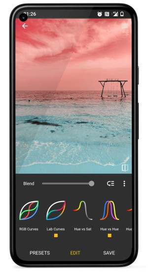
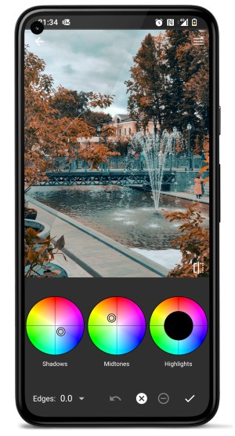
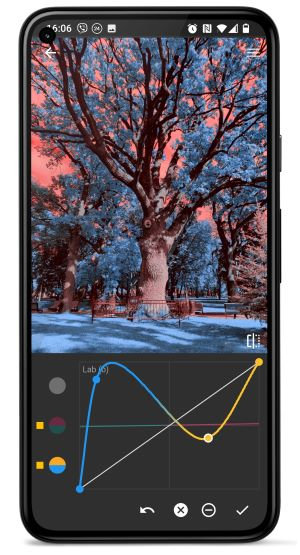
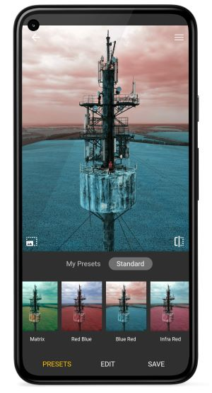
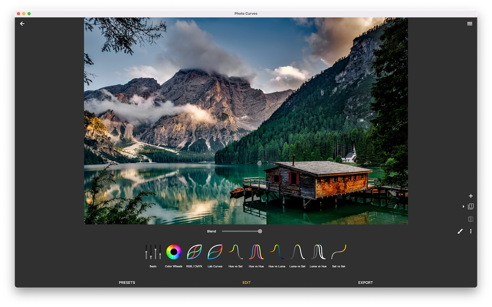

# Photo Curves Color Grading App

**Photo Curves** is a multiplatform photo editor and 3D LUT creator for detailed color correction and creative color grading. Adjust tonal ranges, target individual colors, draw layer masks, and build reusable looks with editable controls.

The app is available for Android, iPhone, iPad, and macOS, with basic video support. Windows and Linux users can edit photos with the browser-based version.

## Download Photo Curves or edit online

[Use Photo Curves Online](https://photocurves.curvednebula.com) for free photo editing in a web browser.

  

## Create custom 3D LUTs and editable presets

Create your own 3D LUTs and export them as `.cube` files for use in compatible photo and video software. Photo Curves also includes example presets that remain fully editable, unlike a flattened LUT.

Use the editor to correct or enhance colors, adjust white balance, replace color ranges, shift hue, or develop stylized looks such as cinematic orange and teal.

## Photo color grading tools

- **Basic controls** — adjust brightness, contrast, shadows, highlights, and saturation.

- **Color wheels** — mix color tones into shadows, midtones, or highlights.

- **Layer masks** — create adjustment layers and draw masks to apply color grading effects to selected parts of an image.

- **RGB curves** — adjust the red, green, and blue channels of the RGB color space.

- **CMYK curves** — adjust the cyan, magenta, yellow, and key channels of the CMYK color space.

- **LAB curves** — separate lightness from color information for additional creative control.

- **Hue vs saturation curve** — select a hue range and change its saturation, such as creating a black-and-white image that preserves one color.

- **Hue vs hue curve** — select a hue range and replace its color, such as changing a blue sky to purple or green grass to orange.

- **Hue vs luma curve** — select a hue range and change its brightness.

- **Luma vs saturation curve** — adjust saturation independently in shadows, midtones, and highlights.

- **Luma vs hue curve** — shift the hue of shadows, midtones, or highlights.

- **Saturation vs saturation curve** — boost muted colors or reduce oversaturated colors for a more even result.

## Color correction and creative editing

Photo Curves can handle both corrective and creative workflows. Use curves and basic controls to balance exposure and color, then add targeted adjustments with hue curves, color wheels, and masks. Because the adjustments remain editable, you can refine a look before exporting the finished image or LUT.

## Frequently asked questions

### Which platforms support Photo Curves?

Photo Curves is available as a native app on Android, iOS, iPadOS, and macOS. The online photo editor also works in modern browsers on Windows, Linux, macOS, and other supported systems.

### Can Photo Curves create `.cube` LUT files?

Yes. You can create a color grade and export it as a standard `.cube` 3D LUT file for compatible applications.

### Is the online photo editor free?

Yes. The browser-based Photo Curves photo editor is free to use. Video editing is limited to the native apps.

### What is the difference between a preset and a LUT?

A LUT applies a fixed color transformation. Photo Curves presets retain their individual adjustment settings, so curves, color wheels, and other controls can be edited after a preset is applied.
